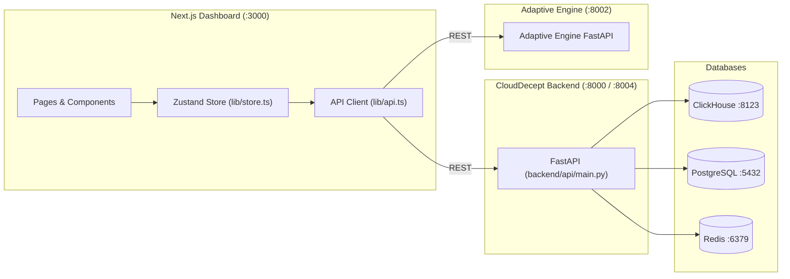

# CloudDecept Dashboard <-> Backend API Contract

This document provides the canonical contract between the CloudDecept Backend API (`backend/api/main.py`) and the Next.js Frontend Dashboard (`apps/dashboard`).

---

## 1. Architecture Overview



---

## 2. Global Conventions

1. **Timestamps**: All timestamps sent by the backend are ISO 8601 UTC strings (e.g. `2026-09-09T01:00:00Z` or `2026-09-09 01:00:00`). Frontend normalizes all timestamps using `formatTimestamp` or `date-fns`.
2. **Session Identification**: `session_id` is a string (e.g. hex Cowrie session ID).
3. **Command Event Identification**: `event_id` is the canonical unique ClickHouse ID. The dashboard normalizes `cmd.id = cmd.event_id || cmd.id`.
4. **Auth Event Identification**: `event_id` is the canonical ID. `success` is a boolean.
5. **Deduplication**: Backend queries use `uniqExact(event_id)` and `ReplacingMergeTree` table semantics to guarantee accurate event counts without duplicate inflations.

---

## 3. API Endpoints Specification

### 3.1 Health & Connectivity

- **Endpoint**: `GET /health`
- **Purpose**: System health check for API and attached datastores.
- **Request Parameters**: None
- **Response Format**:
  ```json
  {
    "status": "healthy",
    "clickhouse": "healthy",
    "postgres": "healthy",
    "redis": "healthy",
    "timestamp": "2026-09-09T01:00:00.000000"
  }
  ```
- **Dashboard Consumers**: `Header.tsx`, `Sidebar.tsx`, `settings/page.tsx`, `page.tsx`.

---

### 3.2 Telemetry & Aggregated Stats

- **Endpoint**: `GET /stats?hours=24`
- **Purpose**: Key performance metrics, totals, and aggregation time series for cards and charts.
- **Query Parameters**:
  - `hours` (int, default: 24, min: 1, max: 87600): Aggregation time window. When `hours >= 87600`, returns all-time totals.
- **Response Format**:
  ```json
  {
    "total_sessions": 42,
    "total_commands": 156,
    "unique_attackers": 12,
    "recent_sessions": 8,
    "recent_commands": 35,
    "recent_unique_attackers": 3,
    "active_sessions": 2,
    "top_intents": [
      { "intent": "credential_hunting", "count": 18 },
      { "intent": "cloud_recon", "count": 12 }
    ],
    "top_countries": [
      { "country": "US", "count": 25 },
      { "country": "DE", "count": 10 }
    ],
    "threat_distribution": [
      { "level": "Critical", "count": 3 },
      { "level": "High", "count": 8 },
      { "level": "Medium", "count": 14 },
      { "level": "Low", "count": 17 }
    ],
    "sessions_per_hour": [
      { "hour": "00:00", "count": 2 }
    ],
    "commands_per_day": [
      { "date": "2026-09-08", "count": 45 }
    ]
  }
  ```
- **Dashboard Consumers**: `page.tsx` (StatCards), `analytics/page.tsx` (Recharts time series).

---

### 3.3 Sessions Listing

- **Endpoint**: `GET /sessions?limit=50&offset=0&intent=...&hours=24`
- **Purpose**: Paginated list of honeypot sessions.
- **Query Parameters**:
  - `limit` (int, 1-500, default: 50)
  - `offset` (int, default: 0)
  - `intent` (string, optional)
  - `hours` (int, 1-87600, default: 24)
- **Response Format**: Direct JSON array `list[SessionSummary]`:
  ```json
  [
    {
      "session_id": "8f3b2a1c",
      "start_time": "2026-09-09T00:15:00",
      "end_time": "2026-09-09T00:22:00",
      "duration_seconds": 420,
      "attacker_ip": "198.51.100.24",
      "country": "US",
      "protocol": "ssh",
      "commands_executed": 14,
      "credentials_tried": 3,
      "intent": "credential_hunting",
      "skill_level": 7
    }
  ]
  ```
- **Frontend Normalization (`transformSession`)**:
  - `src_ip`: Maps from `attacker_ip`.
  - `src_country`: Maps from `country`.
  - `command_count`: Maps from `commands_executed`.
  - `threat_score`: Computes `min(skill_level * 10, 100)`.
  - `status`: `'active'` if `!end_time`, else `'closed'`.
  - `auth_success`: `true` if credentials tried and commands executed, `false` if credentials tried and 0 commands executed, else `undefined`.
- **Dashboard Consumers**: `sessions/page.tsx`, `page.tsx`, `adaptations/page.tsx`.

---

### 3.4 Session Details

- **Endpoint**: `GET /sessions/{session_id}`
- **Purpose**: Retrieve single session metadata.
- **Response Format**: Single `SessionSummary` object.
- **Dashboard Consumers**: `sessions/[sessionId]/page.tsx`.

---

### 3.5 Session Commands

- **Endpoint**: `GET /sessions/{session_id}/commands?limit=100`
- **Purpose**: All commands executed in a session.
- **Query Parameters**:
  - `limit` (int, 1-500, default: 100)
- **Response Format**: Direct JSON array `list[CommandResponse]`:
  ```json
  [
    {
      "event_id": "evt-12345",
      "session_id": "8f3b2a1c",
      "timestamp": "2026-09-09T00:16:12",
      "command": "cat /etc/passwd",
      "arguments": [],
      "exit_code": 0,
      "output": "root:x:0:0:root:/root:/bin/bash...",
      "intent": "credential_hunting",
      "intent_confidence": 0.94,
      "mitre_techniques": ["T1003", "T1082"]
    }
  ]
  ```
- **Frontend Normalization**:
  - `id`: `c.event_id || c.id`
  - `success`: `c.exit_code === 0`
- **Dashboard Consumers**: `sessions/[sessionId]/page.tsx`, `commands/page.tsx`.

---

### 3.6 Session Authentication Attempts

- **Endpoint**: `GET /sessions/{session_id}/auth?limit=50`
- **Purpose**: Authentication attempts for a session.
- **Query Parameters**:
  - `limit` (int, 1-100, default: 50)
- **Response Format**: Direct JSON array `list[AuthAttemptResponse]`:
  ```json
  [
    {
      "event_id": "auth-67890",
      "session_id": "8f3b2a1c",
      "timestamp": "2026-09-09T00:15:05",
      "username": "admin",
      "password": "Password123!",
      "success": true,
      "auth_method": "password"
    }
  ]
  ```
- **Dashboard Consumers**: `sessions/[sessionId]/page.tsx` (Auth Attempts tab & timeline).

---

### 3.7 Session Intelligence Summary

- **Endpoint**: `GET /sessions/{session_id}/summary`
- **Purpose**: Persisted or AI-generated threat intelligence narrative, techniques, and IOCs.
- **Response Format**:
  ```json
  {
    "session_id": "8f3b2a1c",
    "summary": "Attacker performed systematic credential hunting targeting shadow files and AWS keys.",
    "intent": "credential_hunting",
    "skill_level": 7,
    "mitre_techniques": ["T1003", "T1082"],
    "iocs": ["198.51.100.24", "Password123!"],
    "created_at": "2026-09-09T00:23:00"
  }
  ```
- **Dashboard Consumers**: `sessions/[sessionId]/page.tsx` (Threat Intel tab).

---

### 3.8 Global Threat Intelligence Indicators

- **Endpoint**: `GET /threat-intel?limit=50&severity=...&ioc_type=...`
- **Purpose**: Cross-session Indicators of Compromise (IOCs) from PostgreSQL.
- **Query Parameters**:
  - `limit` (int, 1-200, default: 50)
  - `severity` (string, optional: `critical`, `high`, `medium`, `low`)
  - `ioc_type` (string, optional: `ip`, `domain`, `hash`, `credential`)
- **Response Format**: Direct JSON array `list[ThreatIntelResponse]`:
  ```json
  [
    {
      "id": "ioc-99",
      "ioc_type": "ip",
      "ioc_value": "198.51.100.24",
      "confidence": 0.95,
      "mitre_techniques": ["T1003"],
      "mitre_tactics": ["Credential Access"],
      "severity": "high",
      "context": "Repeated brute-force attempts on Cowrie SSH",
      "enrichment": {},
      "created_at": "2026-09-09T00:25:00"
    }
  ]
  ```
- **Dashboard Consumers**: `threat-intel/page.tsx` (IOCs tab).

---

### 3.9 MITRE ATT&CK Techniques

- **Endpoint**: `GET /mitre/techniques`
- **Purpose**: Ranked list of observed MITRE techniques from commands and threat intel.
- **Response Format**:
  ```json
  [
    { "technique": "T1082", "count": 42 },
    { "technique": "T1003", "count": 28 },
    { "technique": "T1059", "count": 19 }
  ]
  ```
- **Dashboard Consumers**: `threat-intel/page.tsx` (MITRE Matrix tab).

---

### 3.10 Top Executed Commands

- **Endpoint**: `GET /commands/top?limit=20&hours=24`
- **Purpose**: Most frequent shell commands across all sessions.
- **Response Format**:
  ```json
  [
    { "command": "uname -a", "executions": 34, "unique_sessions": 12 },
    { "command": "whoami", "executions": 29, "unique_sessions": 11 }
  ]
  ```
- **Dashboard Consumers**: `page.tsx` (Top Executed Commands terminal panel).

---

### 3.11 Full-Text Session Search

- **Endpoint**: `POST /search/sessions?query=...&limit=50`
- **Purpose**: Search sessions by command string or command output.
- **Response Format**: Array of matching `SessionSummary` objects.
- **Dashboard Consumers**: `store.ts` (`searchSessions`).

---

### 3.12 Adaptive Engine Integration

- **Endpoint**: `GET /api/adaptive/strategies` (or via Adaptive Engine :8002 `/strategies`)
- **Purpose**: Retrieve active adaptive defense policies.
- **Response Format**:
  ```json
  {
    "credential_capture": {
      "name": "Credential Capture Decoy",
      "description": "Generates fake AWS credentials and SSH keys to trace exfiltration paths"
    },
    "fake_environment": {
      "name": "Synthetic Environment",
      "description": "Presents deceptive cloud resource listings and mock system configurations"
    },
    "throttle": {
      "name": "Latency Throttling",
      "description": "Introduces artificial delays to slow automated scanning tools"
    }
  }
  ```
- **Dashboard Consumers**: `adaptations/page.tsx`.

---

## 4. Page-by-Page Component Verification Matrix

| Page Route | Required Backend Endpoint(s) | Primary State / Store Action | Dead Buttons / Broken Elements Fixed |
| :--- | :--- | :--- | :--- |
| `/` (Overview) | `GET /stats`, `GET /sessions`, `GET /commands/top`, `GET /health` | `fetchStats`, `fetchSessions`, `fetchTopCommands` | Removed duplicate `<header>`; wired refresh button; fixed 24h Commands stat card; wired auto-refresh checkbox; populated RECENT COMMANDS with `topCommands`. |
| `/sessions` | `GET /sessions` | `fetchSessions`, `filters` | Added functional CSV export; corrected auth badge to handle true/false/N/A without false negatives; enabled search and intent filter. |
| `/sessions/[sessionId]` | `GET /sessions/{id}`, `GET /sessions/{id}/commands`, `GET /sessions/{id}/auth`, `GET /sessions/{id}/summary` | `fetchSessionCommands`, `fetchSessionAuth`, `fetchSessionThreatIntel` | Fixed `cmd.event_id \|\| cmd.id` keys and expand toggle; added dedicated Auth Attempts tab; handled threat intel narrative and IOCs gracefully; added copy feedback. |
| `/threat-intel` | `GET /sessions`, `GET /threat-intel`, `GET /mitre/techniques` | `fetchThreatIntelItems`, `fetchMitreTechniques` | Added interactive tabs (Overview / IOCs / MITRE Matrix); populated real IOCs from backend; displayed real MITRE technique counts. |
| `/commands` | `GET /sessions`, `GET /sessions/{id}/commands` | `fetchSessions`, `fetchSessionCommands` | Auto-selects active session with commands; fixed expand toggle with `event_id`; added CSV export and copy feedback. |
| `/adaptations` | `GET /sessions`, `GET /api/adaptive/strategies` | `fetchSessions`, `getAdaptiveStrategies` | Eliminated fake `Math.random()` data; connected deterministic intent-to-strategy deception policy mapping with live session telemetry. |
| `/analytics` | `GET /stats`, `GET /sessions` | `fetchAllTimeStats`, `fetchSessions` | Uses authoritative backend stats for all charts with session-based fallback. |
| `/settings` | `GET /health` | `getHealth` | Replaced fake `Math.random()` connection test with real multi-service health inspection; added JSON telemetry export and settings persistence. |
